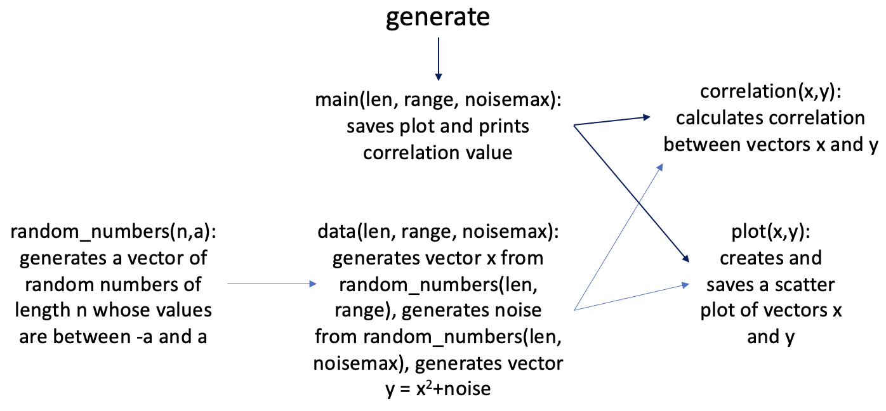

# Project 1 - Rust Command Line Tool
This product has three parameters: the length of the vectors, the range of the values, and the maximum amount of noise. When the tool is run, it calculates two vectors: x which contains 100 random vectors whose absolute value is less than the provided range value (so if the range is 20, the values will be between -20 and 20) and y which contains the squared values from the x vector with an added random noise value (where the absolute values of the random noise values are all less than the maximum amount of noise). Finally, the function outputs the correlation value between the two vectors. This allows users to examine how correlation can change based on vector size, range, and noise.
Additionally, the product produces a scatter plot of the points generated:

Finally, there is some basic testing to ensure the tool is running correctly. For a vector length of 100, the product runs in 0.86 seconds. For a vector length of 100,000, the product runs in 1.68 seconds.

## References

* [rust-project-template](https://github.com/nogibjj/rust-new-project-template)
